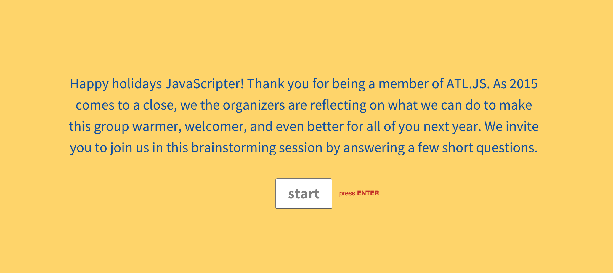
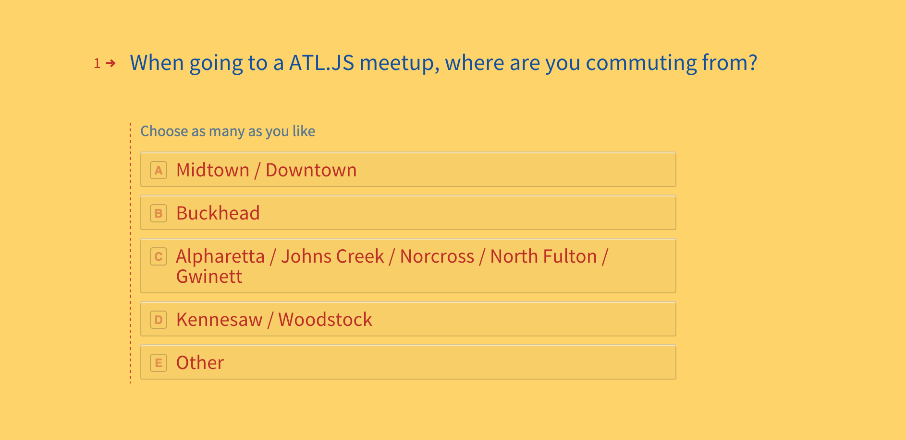
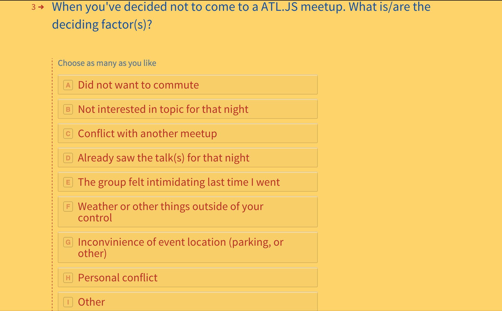
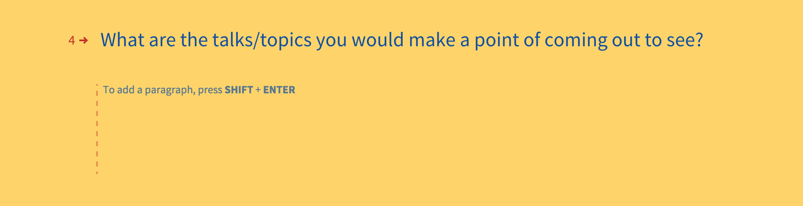
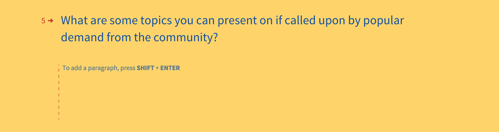
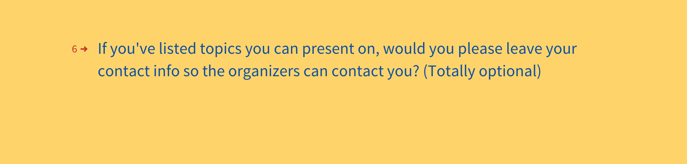
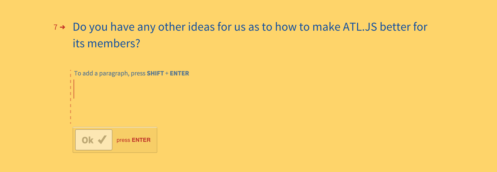

# Responses from ATL.JS End-of-Year Survey 2015

responses_public.csv contains 83 survey responses, except with the private contact information removed. The survey itself is as follows.

## Goals

The survey was created out of our desire to:

* Welcome all members regardless of race, sex, age, skill level, and economic background. Be inclusive
* Help each other level up in our programming skills.
* Help each other advance in our careers.
* Motivate each other to be more active in participating in the community.

## Next Steps

Now that we have this data, what do we do with it? Well, **you** can help with that!

1. Help us make sense of the data by
  * Creating visualizations and [sending us a link](https://github.com/atlantajavascript/end-of-year-survey-2015/issues/new) or [pull request](https://github.com/atlantajavascript/end-of-year-survey-2015/pulls).
  * Spotting trends then [telling us](https://github.com/atlantajavascript/end-of-year-survey-2015/issues/new) what you found.
2. [Suggest ideas](https://github.com/atlantajavascript/end-of-year-survey-2015/issues/new) that will help us advance our goals given the trends we found in the responses collected.

